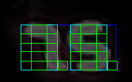

# Recognize Digits
Recognize digits on LCD displays directly from an IP camera.
Main purpose of this is for an actively lit up display in a dark room such as a basement.
Configuration input file yaml.

## Supports

- Individual lights as boolean attributes.
- Active lit displays.
- Letters that can be display on an 8 segment display.

# Why
I did this project because I have a Chemtrol250 pool monitor and there is no means to get
the digital data out of it digitally.  I wanted the ability to take a sample every minute,
record it in a database and display it on Home Assistant.

# How it works
First off, the display is actively lit, which means its easy to see when the lights are off in
the dark.  I chose not to use IR lighting, mainly so the camera wasn't easily noticable.

## Yaml
YAML is used as the input as I had too many inputs to pass directly.  See the chemtrol.yaml 
for an example.

## Cropped Image with Light On
The image cropped with the light on to show what we are working with.

## Cropped Image with Light Off
This is how vast majority of the data samples are taken without the light on.  Green outline
shows where the warp is done, outlining the device.

## Warp
Image after doing the warp.  Notice each of the digits still have a warp to them.  That's because
The Chemtrol device has the digits leaning to be stylish.

## Individual Displays
Then we crop and warp to each display.  Both are contrived as for the warp there is nothing
framing this digit lean.

## Read Digit Segments
Now that we have the image cropped and warped we can read the digit segments.

The corners are intentionally taken out of the boxes to test if more pixels are on or off as
all we are concerned with is that segment on or off.

At this point we identify the digits by mapping the segments to a digit or letter.  I pump
this to a database as well as Home Assistant to view.
